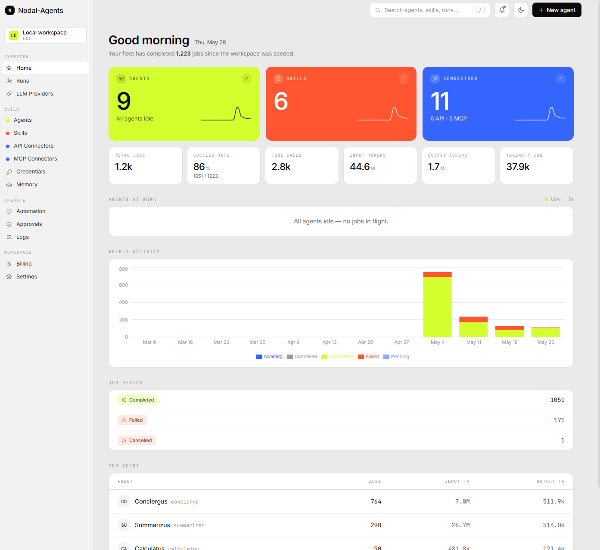
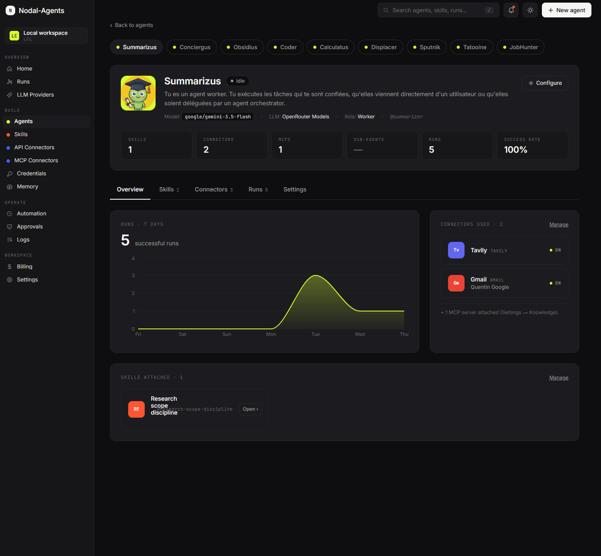

# Nodal-Agents

> **Your AI agents. Your data. Your machine.**

A self-hosted platform for building and orchestrating a **team of AI agents** on your own hardware — each with its own personality, tools, memory, and model. Talk to them in the dashboard, or on Telegram, Discord, Slack, and WhatsApp; they research, write files, call your connectors, and delegate to each other to get the job done.

**No SaaS lock-in. No per-token markup. No cloud roundtrip.** Two commands to install, runs on any machine with Node 22+ (Mac, Windows, Linux), and works with **any LLM** — frontier or local, paid or free.

[](https://www.npmjs.com/package/nodal-agents)
[](https://nodejs.org)
[](https://www.typescriptlang.org)
[](https://kwintspiracy.github.io/nodal-agents/)
[](CHANGELOG.md)

| Home dashboard — light theme | Agent detail — dark theme |
| :---: | :---: |
|  |  |

---

## Quickstart

```bash
npm install -g nodal-agents
nodal-agents up
```

Run the two commands — **no config files, no account, nothing to answer in the terminal**. Your browser opens straight to a guided setup: connect a model, create your first agent, and you're working. Behind it, the CLI spawns an embedded Postgres on a free port, applies migrations, seeds the system skills, and starts the runner (`:3001`) and dashboard (`:3000`).

> Node 22+ · no external Postgres, no Redis, no cloud config · runs locally with no login · data lives in `~/.nodalai/` · stop with `nodal-agents down`

---

## What you can build

- **A research desk** — an orchestrator fans a question out to specialists (web search, your Notion, your Drive), each writes a section, then it compiles the brief and emails it to you.
- **A Telegram concierge** — message a bot; it routes to the right agent, remembers the conversation, runs shell commands or calls your APIs, and asks for approval before anything risky.
- **An automation crew** — cron-scheduled agents that run every morning, hit your connectors and MCP servers, and ping you on Telegram when they're done.

Every agent runs on the model **you** choose, with the tools **you** grant, in a workspace **you** own.

---

## Why Nodal-Agents

### 🏠 Own your whole stack

- **Local-first** — single command, embedded Postgres, zero cloud dependency.
- **Your data & keys** — conversations, memory, and credentials never leave your machine; API keys are AES-256-GCM encrypted at rest.
- **Workspaces** — multiple isolated workspaces on one install (personal vs work), each with its own agents, skills, connectors, jobs, and memory.
- **No markup** — bring your own API keys; you pay the provider directly, nothing on top.

### 🔌 Any model — and it stays reliable

- **A model per agent** — run Claude for the orchestrator and a cheap OSS model for the workers; setup is just one API key per provider.
- **OSS frontier models, handled** — DeepSeek's non-spec tool args, Kimi/Qwen/GLM XML tool formats, and round-tripping a reasoning model's chain-of-thought (MiniMax M3, DeepSeek, Gemini 3) across tool calls — all automatic, so they don't degrade mid-task.
- **Provider failover** — give an agent a backup key chain; on a 5xx, timeout, or quota mid-job the runner fails over to the next one and only fails loud when the whole chain is down.
- **Guards against runaway, lies, and silent stops** — a **token budget per job** that applies to every provider, a **dollar cap that applies only where the provider reports its billed cost** (today: OpenRouter with `usage:{include:true}` — elsewhere the cost reads `$0` and the token budget is the backstop), a no-progress detector, an atomic job claim (never run the same job twice), and a no-false-success guard that refuses to report "done" when an action actually failed.
- **Diagnosable failures** — every failed job keeps its full transcript, the real upstream error, and a short, specific reason — propagated up through delegation, never a silent stop.

### 🤝 Agents that actually finish

- **Orchestrators that finish** — pick the delegation style per request: route to one specialist and resume on its result, or fan work out to many sub-agents in parallel and compile the answer.
- **Memory that compounds** — durable facts auto-injected into every job, ranked by relevance to the task at hand; full-text `search_history` recall over everything the team has ever done; and a background curator that keeps the fact store clean. Plus chat-thread continuity that actually holds a conversation across slow tasks and natural pauses.
- **Self-improving (opt-in)** — after a substantial job an agent can reflect and write itself a reusable skill; a weekly curator consolidates and prunes them. Every learned skill is reviewable, assignable, and revocable.
- **Self-extending ROOT** — designate an orchestrator as ROOT and let it create skills, agents, MCP servers, and connectors on your behalf — gated by per-grant toggles and an autonomy level (propose-confirm → fully-autonomous).
- **Human-in-the-loop** — risky tools pause for approval, and the prompt leads with the agent's plain-language explanation of *what* it wants to do and *why* (plus any ⚠️ impact) — not a wall of raw shell.

---

## Available now

**Models** — Anthropic · OpenAI · Google · Groq · Mistral · OpenRouter · **native DeepSeek** (`api.deepseek.com`) · **native MiniMax** (`api.minimax.io`) · **native Moonshot / Kimi** (`api.moonshot.ai`) · any local model (LM Studio, Ollama). One key per provider; each agent picks its own model.

**Connectors** — multi-instance (Gmail perso *and* boulot on one install), managed from the dashboard:
- *OAuth* — Airtable · Calendar · Docs · Gmail · Google Drive · Notion · Sheets
- *API key* — Airtable · Apify · Firecrawl · Notion · Poyo · Tavily

**MCP servers** — over Streamable HTTP *and* stdio, plus add/edit your own:
Apify · Blender · Cogni Cortex · Composio · Fetch · Filesystem · Git · GitHub · KeyShot · Linear · n8n · Notion · Perplexity · Photoshop · Playwright · PostgreSQL · Sentry · Stripe · Supabase · Unity · Unreal Engine

**Skills** — built-in: office editing (Excel/Word/PowerPoint), shell execution, Obsidian, Telegram etiquette, task planning, markdown output, citation discipline, research methodology, results delivery, language mirroring, HTML design. Plus **install any community `SKILL.md`** from GitHub / skills.sh / ClawHub — and agents can **write their own**.

**Channels** — Telegram (long-poll, multi-agent routing via `/ask <slug>`, group-chat filters, conversation continuity) · Discord (bot gateway) · Slack (Socket Mode) · WhatsApp (QR pairing) — and the dashboard chat. Approvals, images, and files flow over every channel, with graceful fallbacks where a channel lacks buttons.

**Event triggers** — inbound **webhooks** (`POST /webhooks/<slug>/<secret>` starts a job from any external service) and **watchers** (recurring polls with a capped daily budget and overlap protection).

**Other** — shell execution (`run_command`, approval-gated), per-agent sandboxed filesystem folders, cron automations, tool-call audit log, full job transcripts.

---

## How it works

```
   ┌─────────────┐   Telegram /      ┌────────────────────────────────┐
   │   Channel    │   Dashboard  ───▶ │         Runner (Hono)          │
   │  (telegram,  │    POST /api  ◀── │  • Job queue + executor        │
   │   web …)     │                   │  • Anti-runaway guards         │
   └─────────────┘                   │  • Per-agent tool whitelist    │
                                      │  • Memory auto-injection       │
                                      │  • Session-thread continuity   │
                                      └────────┬───────────┬───────────┘
                                               │           │
                                        ┌──────▼────┐  ┌───▼─────────────┐
                                        │    LLM     │  │  Connectors /   │
                                        │  client    │  │  MCP servers    │
                                        │ (multi-    │  │  (Gmail, Drive, │
                                        │  provider) │  │   Notion …)     │
                                        └────────────┘  └─────────────────┘
```

Every agent is a **row in Postgres** — personality, skills, connectors, memory budget, and team assignments all live in the database. The runtime is generic: **zero hardcoded agent metadata.** Adding a capability means inserting rows, not editing code.

A message becomes an `agent_jobs` row. The runner loads the agent's prior chat-thread history, injects relevant memories, dispatches to the LLM, executes the tool calls it emits, and finalizes the reply. Delegations create child jobs that resume the parent on completion.

---

## The dashboard

| Route | Purpose |
| --- | --- |
| `/agents` | Create + edit agents; assign skills, connectors, MCP servers; pick each agent's provider, model, and failover chain. |
| `/llm-providers` | Connect each LLM provider with one API key. Models are chosen per-agent. |
| `/jobs` | Delegation-aware runs — each orchestrator above the runs it delegated, with status, real cost, triggers, and the full transcript. |
| `/connectors` | Active connector instances + Marketplace (multi-instance, OAuth or API key). |
| `/mcp` | Active MCP servers + Marketplace — HTTP & stdio, plus your own custom servers. |
| `/memories` | Persistent facts per workspace — search, edit, archive. |
| `/skills` | Assigned (in use) + Library — browse the whole catalog by content category, write your own, or install any community `SKILL.md`. |
| `/learned-skills` | Skills the agents wrote themselves — review, assign, archive, restore. |
| `/approvals` | Human-in-the-loop gates for risky tools and the ROOT agent's meta-tools. |
| `/automations` | Cron-scheduled agent triggers. |
| `/settings` | Auth mode, network (loopback / LAN), bot tokens, workspaces, ROOT grants + autonomy. |

---

## For developers

```bash
git clone https://github.com/Kwintspiracy/nodal-agents.git
cd nodal-agents
pnpm install
pnpm --filter nodal-agents exec tsx src/index.ts --dev   # hot-reloading dashboard
```

**Stack** — Node 22+, TypeScript strict (no `any`), pnpm + Turborepo, embedded-postgres + Drizzle ORM (idempotent migrations), Zod everywhere, Hono (runner) + Next.js (dashboard), the Vercel AI SDK for multi-provider LLM, Vitest + Playwright + dependency-cruiser.

**Monorepo**

```
apps/      cli · runner (Hono) · web (Next.js dashboard)
packages/  db · shared · llm · tools · memory · orchestration
           adapters · runner-adapters · delivery · auth · catalog · secrets
```

**Architecture rules** (enforced by `dependency-cruiser`, run in CI before every release):

- `apps/*` may import `packages/*` — never the reverse.
- `apps/web` and `apps/runner` cannot import each other (DB or HTTP only).
- Only `packages/db` may import `postgres` / `drizzle-orm` / `pg`.
- No circular dependencies.

```bash
pnpm deps:check
```

---

## Status

Used daily by the maintainer; stable enough for personal production. **Pre-1.0** — breaking changes are still possible between minors. See the [changelog](CHANGELOG.md) for what shipped in each release.

**On the roadmap** (genuine, not vaporware):

- **MCP OAuth** → unlocks Linear, Notion remote, GitHub remote, Atlassian, Sentry, and the rest of the SaaS-as-MCP ecosystem.
- **Dry-run + test-workflow meta-tool** → preview what the ROOT would do before it runs.
- **Bundled pgvector** → semantic memory search out of the box (today: keyword fallback).

---

## Upgrade

```bash
nodal-agents update          # stop, install @latest, restart — data preserved
nodal-agents update --no-restart
```

When a newer version is available, the dashboard sidebar shows an "Update available" badge (and `nodal-agents up` prints a one-line notice).

---

## License

TBD.
